# 🛡️ Write-Up: Myfirsthacking.zip
## Dificultad: Fácil

Objetivo: Obtener acceso inicial y escalar privilegios.

🔍 Enumeración
Se descomprime el archivo Duque.zip y se ejecuta la máquina virtual.

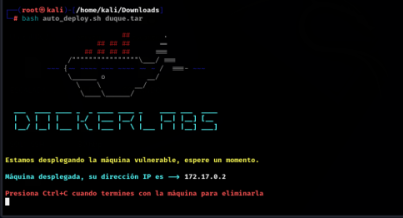

Se realiza un escaneo completo de puertos con Nmap:

```Bash
nmap -p- -sC -sV --open -sS -n -Pn <IP>
```
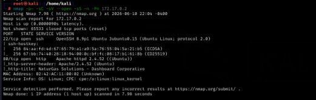

Parámetros utilizados:

-p-: escaneo de todos los puertos

-sC: scripts por defecto

-sV: detección de versiones

--open: muestra solo puertos abiertos

-sS: SYN scan (sigiloso)

-n: evita resolución DNS

-Pn: omite ping previo

📌 Resultados

Puerto 22: SSH

Puerto 80: HTTP

Clásico en máquinas virtuales, puertos abiertos 80 y 22. Luego de revisar la página web en el navegador, encontramos una posible pista en el botón Intranet, sobre el cual nos dice que no tenemos permiso. Por el momento, realizamos un gobuster para ver si localizamos directorios ocultos.

´´´Bash
gobuster dir -u http://172.17.0.2 -w /usr/share/wordlists/dirbuster/directory-list-lowercase-2.3-medium.txt -x php,bak,html,txt
´´´
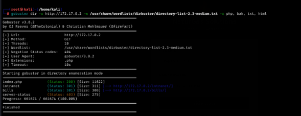

Encontramos algunos directorios interesantes. Al agregar el directorio /bills en el navegador, la página nos da la posibilidad de colocar credenciales de ingreso. Intentamos el famoso código de Inyección SQL para intentar ingresar.

```Bash
admin' OR 1=1 -- -
```
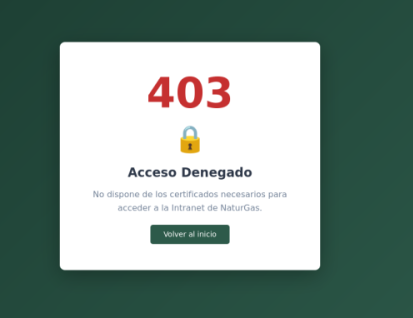

Logramos ingresar con el usuario Mario, pero no es suficiente, necesitamos una cuenta con mayores privilegios. Lo importante acá, es que descubrimos que la web es vulnerable a la Inyección SQL debido a la forma en que se programa la consulta sql en el backend. Procedemos a realizar extracción de datos mediante sqlmap.

```Bash
sqlmap -u "http://172.17.0.2/bills/index.php" --data="username=admin&password=admin" --dbs --batch
```
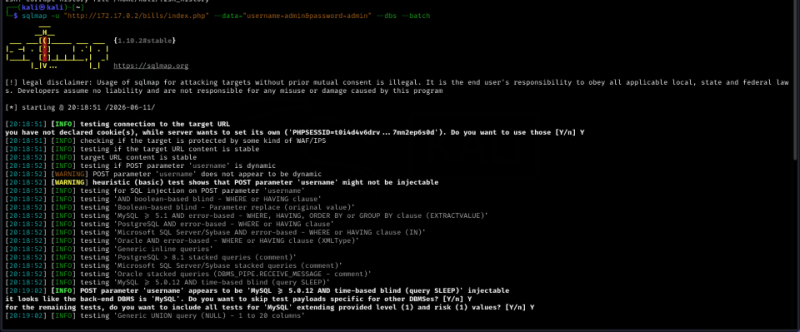
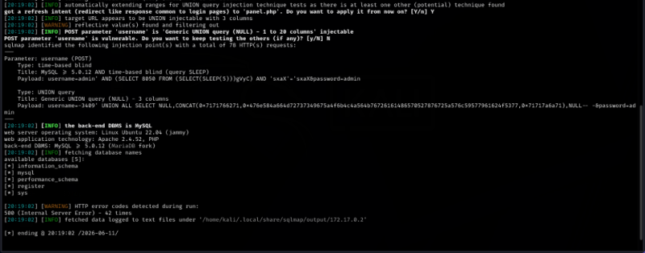

Parámetros utilizados:

-u "http://172.17.0.2/bills/index.php": Especifica la URL del objetivo (Target) donde se encuentra el formulario vulnerable.

--data="username=admin&password=admin": Le indica a la herramienta que el formulario utiliza el método POST para enviar los datos (viajan en el cuerpo de la petición HTTP y no en la URL). Además, le provee la estructura exacta de los parámetros (username y password) y unos valores de prueba genéricos para que sepa dónde empezar a inyectar.

--dbs: Es el parámetro de enumeración que le ordena a sqlmap que, una vez que logre romper el parámetro, extraiga los nombres de todas las Bases de Datos (Databases) disponibles en el servidor.

--batch: Automatiza las respuestas de la herramienta. Le dice a sqlmap que elija la opción por defecto cada vez que el programa requiera una interacción del usuario. Esto agiliza el proceso.

Perfecto. Obtuvimos las bases de datos disponibles en el servidor:

information_schema

mysql

performance_schema

sys

register

Antes de romper las tablas, vamos a verificar los privilegios que tiene el usuario que usa la web, utilizando el siguiente comando:

```Bash
sqlmap -u "http://172.17.0.2/bills/index.php" --data="username=admin&password=admin" --is-dba --batch
```
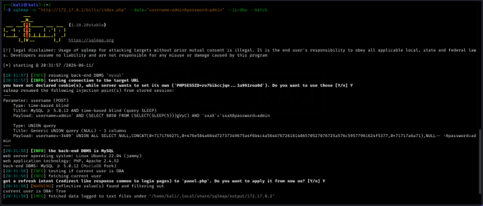

Parámetros utilizados:

--is-dba: Proveniente de las iniciales DBA (Database Administrator), envía una consulta específica a la base de datos para interrogarla sobre los privilegios del usuario. En base a la respuesta de la base de datos, podemos saber qué privilegios tiene el usuario.

Vemos que nos da current user is DBA: True, lo cual nos confirma los permisos DBA.

Volvamos a las bases de datos disponibles. De las cinco, solo register nos interesa ya que las demás son genéricas en casi cualquier sistema operativo basado en linux. Realizamos enumeración de tablas sobre register con el siguiente comando, a fin de localizar dónde se almacenan las credenciales de los usuarios.

```Bash
sqlmap -u "http://172.17.0.2/bills/index.php" --data="username=admin&password=admin" -D register --tables --batch
```
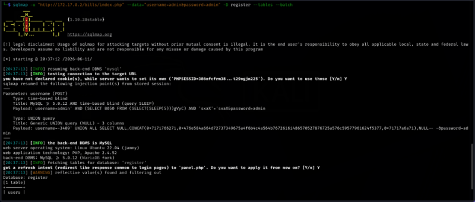

Parámetros utilizados:

-D register: Le ordena a sqlmap que apunte de forma exclusiva a la base de datos llamada register. Al especificar el objetivo, evitamos que la herramienta pierda tiempo escaneando las bases de datos nativas del sistema.

--tables: Es el parámetro de enumeración que le indica a la herramienta que extraiga la lista completa de tablas contenidas dentro de la base de datos seleccionada.

Obtenemos la tabla users como resultado. Realizamos volcado de credenciales (Dump) a fin de extraer su contenido en texto plano.

```Bash
sqlmap -u "http://172.17.0.2/bills/index.php" --data="username=admin&password=admin" -D register -T users --dump --batch
```
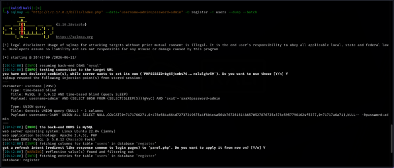
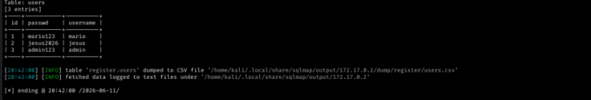

Parámetros utilizados:

-T users: Le indica a sqlmap la tabla específica de la cual queremos extraer la información (en este caso, la tabla users descubierta en el paso anterior).

--dump: Es la orden definitiva de exfiltración. Le indica a la herramienta que vuelque (dump) y descargue absolutamente todo el contenido (columnas y filas) de la tabla seleccionada en la pantalla de la terminal.

Obtuvimos las credenciales de la tabla. Sabiendo que las cuentas básicas carecen de privilegios en el panel, nos enfocamos en la de administración obtenida: admin / admin123. Ingresamos con esos datos en el formulario y llegamos a un buscador de facturas que requiere un ID.

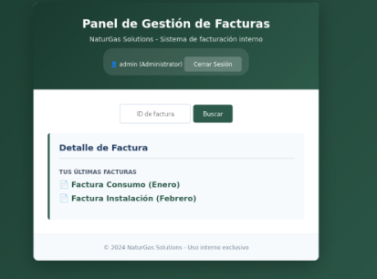

Como anteriormente verificamos que el usuario con el que la página se conecta a la base de datos es DBA, utilizaremos el siguiente comando para extraer el archivo que procesa la lógica de esta página:

```Bash
sqlmap -u "http://172.17.0.2/bills/index.php" --data="username=admin&password=admin" --file-read "/var/www/html/bills/panel.php" --batch
```
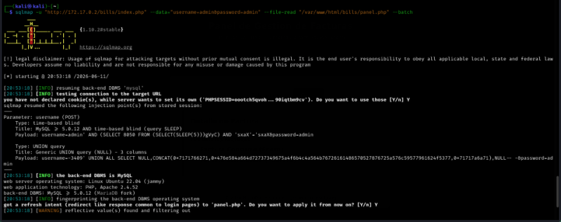
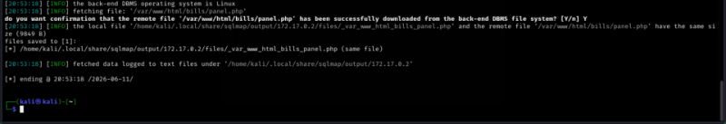

Tener en cuenta que, en sistemas operativos basados en linux, /var/www/html/ es en donde se alojan por defecto las páginas web, por eso colocamos esa ruta, seguido de /bills/panel.php para obtener los archivos.

Observamos que los archivos se descargaron en la ruta /root/.local/share/sqlmap/output/172.17.0.2/.

Luego de revisar los mismos, encontramos que dentro de la ruta output/172.17.0.2/files se encuentra el archivo _var_www_html_bills_panel.php. Realizamos una lectura del mismo con el comando cat.

```Bash
cat _var_www_html_bills_panel.php
```
Divisamos que el ID xyc724 se describe explícitamente en los comentarios del código como vulnerable a IDOR. Lo colocamos en el buscador de Facturas de la web.

Obtenemos el usuario duque junto a su clave de acceso. Datos potencialmente útiles para ingresar al servicio SSH, que recordemos, se encuentra abierto.

🚀 Acceso Inicial y Escalada de Privilegios
Perfecto, ingresamos por SSH de forma exitosa. Al colocar sudo -l, nos responde que no tenemos privilegios sudo con este usuario: Sorry, user duque may not run sudo.

Procedemos a colocar el famoso comando find, que permite buscar archivos que tengan el bit SUID activo, los cuales básicamente nos darán permisos de su propietario (root) al ser ejecutados.

```Bash
find / -perm -4000 -type f 2>/dev/null
```
Desglose Técnico del Comando:
find /: Invoca la herramienta nativa de Linux para buscar archivos y carpetas, ordenándole que inicie la búsqueda desde el directorio raíz (/), es decir, que recorra absolutamente todo el disco rígido de la máquina.

-perm -4000: Es el filtro de permisos. El número 4000 representa el bit especial de SUID. El signo menos (-) le indica a find que busque archivos que tengan al menos ese permiso activo, ignorando el resto de los permisos comunes de lectura, escritura o ejecución.

-type f: Restringe la búsqueda únicamente a archivos regulares (files). Esto evita que la terminal se llene de directorios o enlaces simbólicos.

2>/dev/null: Redirección de errores. En Linux, el número 2 representa el canal de error estándar (stderr). Al usar el descriptor >, le ordenamos al sistema que desvíe todos los mensajes de error de "Permiso denegado" hacia /dev/null, que actúa como un tacho de basura virtual. Esto permite obtener un output limpio en pantalla.

De estos binarios reportados, el que nos interesa por ser una desviación de la norma es /usr/bin/env. Procedemos a investigar en la biblia de la escalada de privilegios, la página web GTFOBins, en la cual buscamos cómo vulnerar el binario env explotando su bit SUID.

Colocamos el comando sugerido en la terminal de la máquina víctima:

```Bash
env /bin/sh -p
```
📌 Resultado

✔️ Se obtuvo una shell con acceso root exitosamente, comprometiendo el sistema y completando el laboratorio por completo.
